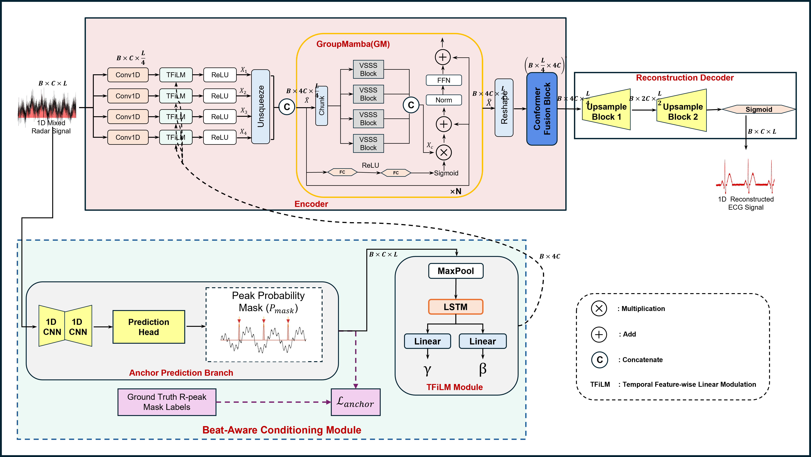
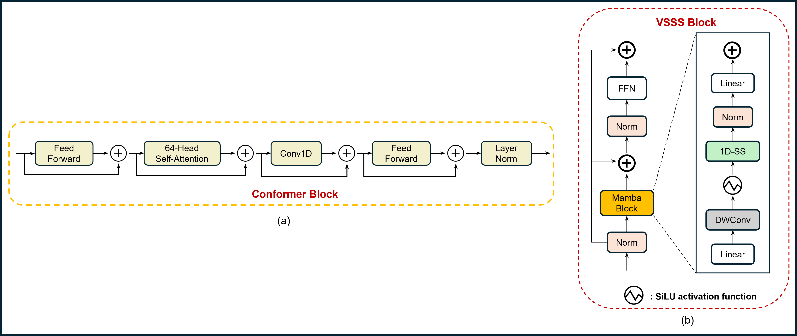

# RQ1: Beat-Aware R-M2Net —— 基于心跳感知与多尺度曼巴网络的雷达生理信号重构
**(Radar-based Physiological Waveform Reconstruction via Beat-Aware Multi-Scale Mamba Network)**

## 1. 研究背景与动机 (Motivation)

本研究旨在解决非接触式生理监测领域的核心难题：**如何从包含大量运动噪声和杂波的24GHz CW雷达信号中，高保真地重构出临床级的心电图 (ECG) 波形。**

现有的方法通常将此任务视为简单的“雷达-ECG”回归问题，忽略了雷达信号（机械胸壁运动）与 ECG 信号（生物电活动）之间存在的**根本域差异 (Fundamental Domain Gap)**。雷达信号往往缺乏明显的特征点（如 R 波峰值），导致模型难以精准对齐心跳相位，生成的波形容易出现“过平滑”现象，丢失 QRS 波群等关键临床细节。

为此，本项目提出了 **Beat-Aware R-M2Net**。该架构并未止步于单纯的波形拟合，而是通过显式引入**节律先验 (Rhythm Prior)** 并利用先进的**状态空间模型 (SSM)**，有效克服了跨域重构的难点，为非接触式健康监测提供了高精度的解决方案。

---

## 2. 核心方法论 (Methodology)

为了应对上述挑战，Beat-Aware R-M2Net 引入了三大核心创新设计：

### 2.1 创新点一：显式心跳感知机制 (Explicit Beat-Aware Mechanism)
为了解决跨域特征不对齐的问题，设计了独立的 **辅助流 (Anchor Branch)**。
* **设计逻辑**：不同于让模型在黑盒中“猜测”心跳位置，该分支被显式监督执行“R 波检测任务”。
* **作用机制**：通过预测 R 波发生的概率掩码 (Mask)，并利用 **TFiLM (Feature-wise Linear Modulation)** 技术，将提取到的节律信息动态注入主干网络。这相当于在特征层面给重构网络“打节拍”，引导模型重点优化 R 波位置的波形形态。

### 2.2 创新点二：基于 GroupMamba 的长程建模 (Long-range Modeling)
针对生理信号长序列（8秒，1600点）的特点，引入 **GroupMamba 模块** 替代传统的 LSTM 或纯 Transformer。
* **优势**：利用 Mamba (SSM) 的线性计算复杂度优势，高效捕捉呼吸导致的基线漂移等长时依赖关系，同时避免了 Transformer 在处理长序列时显存爆炸的问题。

### 2.3 创新点三：多域联合约束 (Multi-Domain Supervision)
为了防止生成波形的高频细节丢失，构建了复合损失函数。
* **策略**：不仅约束时域误差 (L1 Loss)，还设计了 **多分辨率 STFT 损失 (Multi-Resolution STFT Loss)**，强制模型在频域上逼近真实信号。这对于恢复 QRS 波的高频锐度至关重要。

---

## 3. 模型架构参数化详解 (Model Architecture Quantified)

模型代码路径：`models/BA_M2Net.py`

### 3.1 全局张量流 (Global Tensor Flow)
* **输入 (Input)**: $\mathbf{X} \in \mathbb{R}^{B \times 1 \times 1600}$ (Batch, Channel=1, Length=1600)。
* **输出 (Output)**: $\mathbf{Y} \in \mathbb{R}^{B \times 1 \times 1600}$ (归一化 ECG 信号)。
* **基础通道数 ($C$)**: 32。

### 3.2 辅助流：Anchor Branch (Explicit Beat Detection)
该分支保持全分辨率，用于提取样本点级别的注意力。
* **特征提取**:
    * Layer 1: Conv1d($1 \to 16, k=7, s=1, p=3$) $\to$ ReLU
    * Layer 2: Conv1d($16 \to 32, k=5, s=1, p=2$) $\to$ ReLU
    * *设计意图*: 使用大卷积核 ($k=7, 5$) 捕捉 R 波的显著波峰特征。
* **双头输出 (Dual Heads)**:
    1.  **Mask Prediction Head**: Conv1d($1 \to 1$) $\to$ Sigmoid。输出 $\mathbf{M}_{pred}$ 用于 BCE Loss 监督。
    2.  **Parameter Generation Head**: AdaptiveMaxPool1d $\to$ Flatten $\to$ MLP($32 \to 128 \times 2$)。生成全局仿射变换参数 $\gamma, \beta$，用于后续 TFiLM 调制。

### 3.3 主干流：Parallel Multi-Scale Encoder (并行多尺度编码器)
采用并行卷积结构，一次性完成下采样并提取多尺度特征。
* **并行分支 (4 Branches)**: 所有分支 $stride=4$，输出长度压缩至 400。
    * Branch 1: Conv1d($k=3$) $\to$ BN $\to$ **TFiLM** $\to$ ReLU
    * Branch 2: Conv1d($k=5$) $\to$ BN $\to$ **TFiLM** $\to$ ReLU
    * Branch 3: Conv1d($k=7$) $\to$ BN $\to$ **TFiLM** $\to$ ReLU
    * Branch 4: Conv1d($k=9$) $\to$ BN $\to$ **TFiLM** $\to$ ReLU
* **特征融合**: 拼接 4 个分支特征，输出 $\mathbf{X}_{enc} \in \mathbb{R}^{B \times 128 \times 400}$。

### 3.4 核心算子：GroupMamba Block (Bottleneck)
代码路径：`models/group_mamba.py`
利用 SSM 处理压缩后的隐空间序列。
* **结构**: 堆叠 2 个 GroupMamba Block。
* **分组处理 (Grouping)**: 将输入 $[B, 128, 400]$ 切分为 4 个组，每组独立输入 Mamba 单元。
    * State Dimension ($N=16$), Conv Dimension ($d_{conv}=4$), Expansion Factor ($E=2$)。
* **合并 (Merging)**: 并行处理后拼接回原始维度，并通过残差连接输出。

### 3.5 融合层：Conformer Fusion Block
代码路径：`models/layers.py`
* **目的**: 消除 Mamba 扫描可能带来的因果伪影，并结合 Transformer 的全局注意力和 CNN 的局部特征。
* **组件**: FeedForward + MHSA (Heads=4) + Depthwise Separable Conv。

### 3.6 解码器：Progressive Decoder
逐步恢复时域分辨率。
* **Upsample Block 1**: ConvTranspose1d($128 \to 64, k=4, s=2$) $\to$ Length 800。
* **Upsample Block 2**: ConvTranspose1d($64 \to 32, k=4, s=2$) $\to$ Length 1600。
* **Projection**: Conv1d($32 \to 1$) $\to$ **Sigmoid** (映射至 $[0, 1]$)。

---

## 4. 数据流水线 (Data Pipeline)

### 4.1 数据预处理 (`data_preprocessing/`)
* **输入信号**: 24GHz CW 雷达 I/Q 解调后的**胸壁位移信号 (Chest Displacement Signal)**。
    * *物理特征*: 单通道，包含呼吸（低频大幅度）和心跳（高频微小幅度）混合微多普勒特征。
* **输出信号**: 标准 Lead-II ECG 电压信号。
* **处理流程 (`build_dataset.py`)**:
    1.  **降采样**: 统一至 **200 Hz**。
    2.  **带通滤波**: 4阶 Butterworth 滤波器，截止频率 **0.5 Hz - 40 Hz**，去除基线漂移和工频干扰。
    3.  **模态对齐**: 基于互相关 (Cross-Correlation) 最大化，修正雷达传输的时间滞后。
    4.  **异常值剔除**: 基于 ECG 的峭度 (Kurtosis) 和偏度 (Skewness) 进行 SQI 质量控制。
    5.  **切片与归一化**: 窗口大小 $L=1600$ (8秒)，采用 Min-Max Normalization 映射至 $[0, 1]$。

### 4.2 核心创新：Ground Truth 构建 (`src/ecg_dsp.py`)
为了监督 Anchor Branch，构建了 `generate_anchor_mask` 函数：
* 利用 `scipy.signal.find_peaks` 从真实 ECG 中提取 R 波位置。
* 生成与输入等长的 **概率掩码 (Probability Mask)**，在 R 波峰值处设为 1（其余为 0 或高斯平滑），作为辅助任务的 Ground Truth。

---

## 5. 训练与评估 (Training & Evaluation)

### 5.1 损失函数 (`utils/losses.py`)
总损失 $L_{total}$ 由三部分加权组成：
1.  **L1 Loss**: $\mathcal{L}_{time} = ||Y - \hat{Y}||_1$，保证波形整体轮廓一致。
2.  **Multi-Resolution STFT Loss**: $\mathcal{L}_{freq}$，针对 200Hz 信号调整 FFT 参数，确保 QRS 波群频谱保真度。
3.  **BCE Loss**: $\mathcal{L}_{mask}$，监督 Anchor Branch 的 Mask 预测，迫使网络学习正确的心跳节律。

## 6. 训练机制原理 (Training Mechanism)

### 6.1 损失函数配置 (Loss Function Formulation)
为了兼顾时域波形的精确度和频域特征的完整性，本项目采用复合损失函数：

$$
\mathcal{L}_{Total} = \mathcal{L}_{MAE} + \alpha \cdot \mathcal{L}_{STFT} + \beta \cdot \mathcal{L}_{Anchor}
$$

* **$\mathcal{L}_{MAE}$ (L1 Loss)**:
    * **权重**: $1.0$
    * **目的**: 迫使重构波形在数值上逼近 Ground Truth，保证波形整体轮廓和幅值的一致性。

* **$\mathcal{L}_{STFT}$ (Multi-Resolution STFT Loss)**:
    * **权重**: $\alpha=1.0$ (根据实验可微调为 0.1)
    * **参数**: FFT Sizes 设定为 $[64, 128, 256]$。
    * **目的**: 同时最小化**谱收敛距离 (Spectral Convergence)** 和 **对数幅度距离 (Log Magnitude)**。通过多分辨率分析，确保模型能同时捕捉到 QRS 波群的高频锐度细节以及 T 波的低频平滑特征。

* **$\mathcal{L}_{Anchor}$ (BCE Loss)**:
    * **权重**: $\beta=0.1$
    * **目的**: 二分类交叉熵损失 (Binary Cross Entropy)。专门用于监督辅助分支 (Anchor Branch)，迫使其准确区分“R波区域”与“背景噪声”，从而为编码器提供准确的注意力引导。

### 6.2 优化策略 (Optimization Strategy)
* **优化器 (Optimizer)**:
    * 采用 **AdamW** 优化器。
    * 设置 **Weight Decay = 0.01**，引入正则化项以防止模型过拟合。
* **学习率调度 (Scheduler)**:
    * 采用 **Cosine Annealing Warm Restarts** (可选) 或 **ReduceLROnPlateau**。
    * 在损失趋于平稳时动态降低学习率，辅助模型跳出局部最优解。
* **早停机制 (Early Stopping)**:
    * 实时监测验证集 Loss。
    * 设置 **Patience = 10 epochs**。若验证集性能连续 10 个 epoch 未提升，则自动停止训练，保存最佳模型权重。

### 6.3 实验设置
* **训练**: 使用 `train.py` 进行全流程训练，包含 Early Stopping 和 TensorBoard 监控。
* **测试**: 使用 `test.py` 加载最佳权重。
* **评价指标**:
    * **PCC** (Pearson Correlation Coefficient): 评估波形趋势相关性。
    * **RMSE** (Root Mean Square Error): 评估幅值误差。
    * **MAE** (Mean Absolute Error): 评估平均误差。
