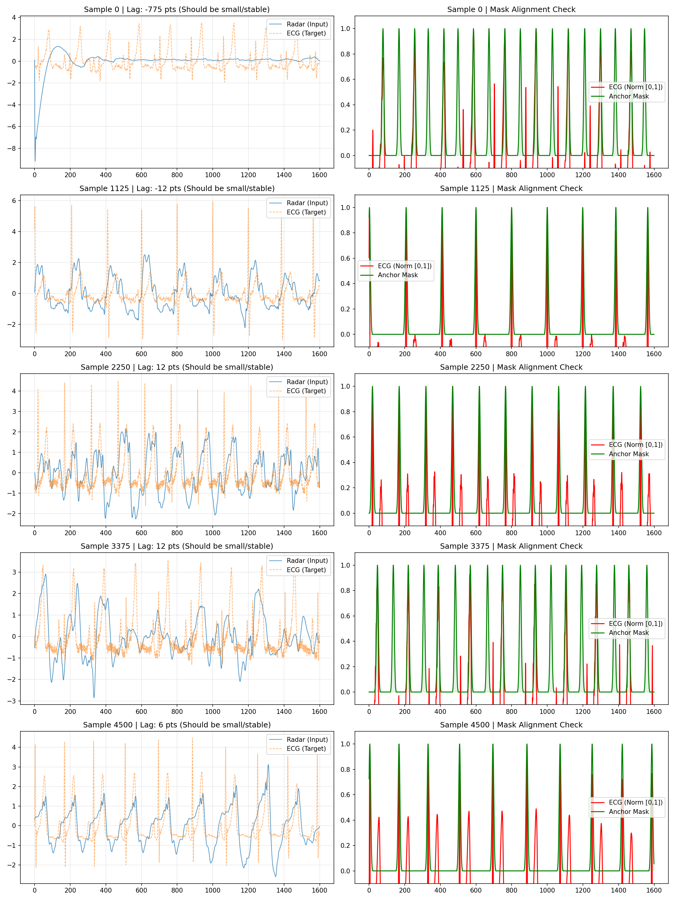
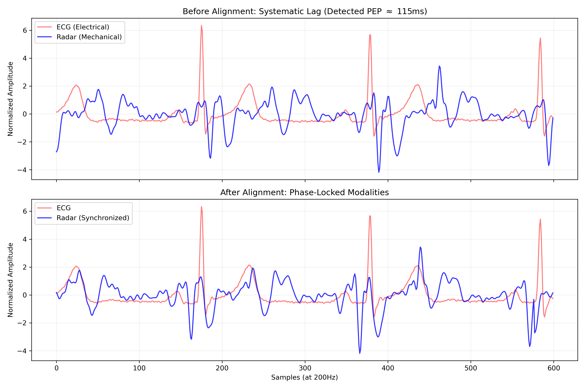
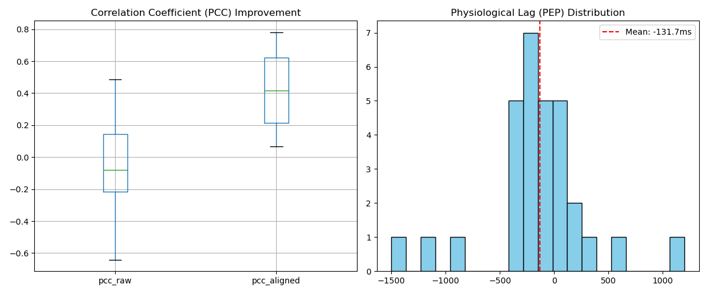

# RQ1: Beat-Aware R-M2Net —— 基于心跳感知与多尺度曼巴网络的雷达生理信号重构
**(Radar-based Physiological Waveform Reconstruction via Beat-Aware Multi-Scale Mamba Network)**

## 1. 研究背景与动机 (Motivation)

本研究旨在解决非接触式生理监测领域的核心难题：**如何从包含大量运动噪声和杂波的24GHz CW雷达信号中，高保真地重构出临床级的心电图 (ECG) 波形。**

现有的方法通常将此任务视为简单的“雷达-ECG”回归问题，忽略了雷达信号（机械胸壁运动）与 ECG 信号（生物电活动）之间存在的**根本域差异 (Fundamental Domain Gap)**。雷达信号往往缺乏明显的特征点（如 R 波峰值），导致模型难以精准对齐心跳相位，生成的波形容易出现“过平滑”现象，丢失 QRS 波群等关键临床细节。

为此，本项目提出了 **Beat-Aware R-M2Net**。该架构并未止步于单纯的波形拟合，而是通过显式引入**节律先验 (Rhythm Prior)** 并利用先进的**状态空间模型 (SSM)**，有效克服了跨域重构的难点，为非接触式健康监测提供了高精度的解决方案。

---

## 2. 核心方法论 (Methodology)

为了应对上述挑战，Beat-Aware R-M2Net 引入了三大核心创新设计：

### 2.1 创新点一：显式心跳感知机制 (Explicit Beat-Aware Mechanism)
为了解决跨域特征不对齐的问题，设计了独立的 **辅助流 (Anchor Branch)**。
* **设计逻辑**：不同于让模型在黑盒中“猜测”心跳位置，该分支被显式监督执行“R 波检测任务”。
* **作用机制**：通过预测 R 波发生的概率掩码 (Mask)，并利用 **TFiLM (Feature-wise Linear Modulation)** 技术，将提取到的节律信息动态注入主干网络。这相当于在特征层面给重构网络“打节拍”，引导模型重点优化 R 波位置的波形形态。

### 2.2 创新点二：基于 GroupMamba 的长程建模 (Long-range Modeling)
针对生理信号长序列（8秒，1600点）的特点，引入 **GroupMamba 模块** 替代传统的 LSTM 或纯 Transformer。
* **优势**：利用 Mamba (SSM) 的线性计算复杂度优势，高效捕捉呼吸导致的基线漂移等长时依赖关系，同时避免了 Transformer 在处理长序列时显存爆炸的问题。

### 2.3 创新点三：多域联合约束 (Multi-Domain Supervision)
为了防止生成波形的高频细节丢失，构建了复合损失函数。
* **策略**：不仅约束时域误差 (L1 Loss)，还设计了 **多分辨率 STFT 损失 (Multi-Resolution STFT Loss)**，强制模型在频域上逼近真实信号。这对于恢复 QRS 波的高频锐度至关重要。

---

## 3. 模型架构参数化详解 (Model Architecture Quantified)

模型代码路径：`models/BA_M2Net.py`

### 3.1 全局张量流 (Global Tensor Flow)
* **输入 (Input)**: $\mathbf{X} \in \mathbb{R}^{B \times 1 \times 1600}$ (Batch, Channel=1, Length=1600)。
* **输出 (Output)**: $\mathbf{Y} \in \mathbb{R}^{B \times 1 \times 1600}$ (归一化 ECG 信号)。
* **基础通道数 ($C$)**: 32。

### 3.2 辅助流：Anchor Branch (Explicit Beat Detection)
该分支保持全分辨率，用于提取样本点级别的注意力。
* **特征提取**:
    * Layer 1: Conv1d($1 \to 16, k=7, s=1, p=3$) $\to$ ReLU
    * Layer 2: Conv1d($16 \to 32, k=5, s=1, p=2$) $\to$ ReLU
    * *设计意图*: 使用大卷积核 ($k=7, 5$) 捕捉 R 波的显著波峰特征。
* **双头输出 (Dual Heads)**:
    1.  **Mask Prediction Head**: Conv1d($1 \to 1$) $\to$ Sigmoid。输出 $\mathbf{M}_{pred}$ 用于 BCE Loss 监督。
    2.  **Parameter Generation Head**: AdaptiveMaxPool1d $\to$ Flatten $\to$ MLP($32 \to 128 \times 2$)。生成全局仿射变换参数 $\gamma, \beta$，用于后续 TFiLM 调制。

### 3.3 主干流：Parallel Multi-Scale Encoder (并行多尺度编码器)
采用并行卷积结构，一次性完成下采样并提取多尺度特征。
* **并行分支 (4 Branches)**: 所有分支 $stride=4$，输出长度压缩至 400。
    * Branch 1: Conv1d($k=3$) $\to$ BN $\to$ **TFiLM** $\to$ ReLU
    * Branch 2: Conv1d($k=5$) $\to$ BN $\to$ **TFiLM** $\to$ ReLU
    * Branch 3: Conv1d($k=7$) $\to$ BN $\to$ **TFiLM** $\to$ ReLU
    * Branch 4: Conv1d($k=9$) $\to$ BN $\to$ **TFiLM** $\to$ ReLU
* **特征融合**: 拼接 4 个分支特征，输出 $\mathbf{X}_{enc} \in \mathbb{R}^{B \times 128 \times 400}$。

### 3.4 核心算子：GroupMamba Block (Bottleneck)
代码路径：`models/group_mamba.py`
利用 SSM 处理压缩后的隐空间序列。
* **结构**: 堆叠 2 个 GroupMamba Block。
* **分组处理 (Grouping)**: 将输入 $[B, 128, 400]$ 切分为 4 个组，每组独立输入 Mamba 单元。
    * State Dimension ($N=16$), Conv Dimension ($d_{conv}=4$), Expansion Factor ($E=2$)。
* **合并 (Merging)**: 并行处理后拼接回原始维度，并通过残差连接输出。

### 3.5 融合层：Conformer Fusion Block
代码路径：`models/layers.py`
* **目的**: 消除 Mamba 扫描可能带来的因果伪影，并结合 Transformer 的全局注意力和 CNN 的局部特征。
* **组件**: FeedForward + MHSA (Heads=4) + Depthwise Separable Conv。

### 3.6 解码器：Progressive Decoder
逐步恢复时域分辨率。
* **Upsample Block 1**: ConvTranspose1d($128 \to 64, k=4, s=2$) $\to$ Length 800。
* **Upsample Block 2**: ConvTranspose1d($64 \to 32, k=4, s=2$) $\to$ Length 1600。
* **Projection**: Conv1d($32 \to 1$) $\to$ **Sigmoid** (映射至 $[0, 1]$)。

---

## 4. 数据流水线与预处理 (Data Pipeline & Preprocessing)

本项目设计了一套具有生理一致性保障的预处理流程，旨在消除异构模态间的域差异并提取关键生理特征。

## Data Preprocessing and Dataset Construction

Raw radar I/Q recordings and synchronized reference ECG signals were preprocessed prior to model training. For radar, the raw complex signal was converted into a phase-related waveform, followed by standard denoising and bandpass filtering to preserve cardiac-related components. For ECG, baseline noise was removed and R-peaks were detected, after which a beat-centered Gaussian anchor mask was generated to provide beat-aware supervision.

To ensure temporal consistency between radar inputs and ECG targets, radar and ECG segments were aligned using cross-correlation-based lag estimation. The aligned radar waveform, aligned ECG waveform, and the corresponding anchor mask were then segmented into fixed-length windows using a sliding-window strategy and saved into HDF5 files for training and testing.

### Dataset Verification and Quality Control

Since radar-to-ECG waveform reconstruction is highly sensitive to residual misalignment, we additionally performed dataset-level verification using a dedicated diagnostic script (`verify_alignment_metrics.py`). The verification includes: (i) numerical sanity checks (shape consistency and NaN/Inf detection), (ii) residual lag analysis on heart-band filtered signals to quantify remaining temporal mismatch, and (iii) beat-level consistency checks between the generated anchor mask and ECG R-peaks.

A small subset of segments exhibited extreme residual lag and was excluded from all experiments to prevent spurious supervision and misleading gradients. The indices of excluded segments were stored and consistently applied during data loading to guarantee reproducibility across all training and evaluation runs.

test.h5
We further conducted an independent quality assessment on the test set. Although no samples were excluded at test time, approximately X% of segments exhibited extreme temporal misalignment (>500 ms), which partially explains the performance degradation in a small number of cases.

写论文 Methods / Data Quality

“We additionally conducted an independent alignment quality assessment on the test set. Importantly, no test samples were excluded during evaluation.”

写 Results / Discussion

“A small proportion of test segments exhibited extreme temporal misalignment (>500 ms), which partially explains the degradation in reconstruction accuracy for certain cases.”

Supplementary / Figure

放 1–2 张 extreme lag 的对比图

用来挡审稿人质疑

### 4.0 核心创新：Ground Truth 构建 (`src/ecg_dsp.py`)
为了监督 Anchor Branch，构建了 `generate_anchor_mask` 函数：
* 利用 `scipy.signal.find_peaks` 从真实 ECG 中提取 R 波位置。
* 生成与输入等长的 **概率掩码 (Probability Mask)**，在 R 波峰值处设为 1（其余为 0 或高斯平滑），作为辅助任务的 Ground Truth。

### 总预处理量化分析：预处理诊断与质量评估 (Preprocessing Diagnostics)
为验证预处理的鲁棒性，本项目建立了一套自动化评估机制，通过生成的诊断报告（如 `data_quality_report.png`）进行质量监控。

**诊断基准指标：**
* **呼吸滤除度**: 检查雷达基线是否平稳，不应存在周期大于 2 秒的大幅度波动。
* **相位滞后稳定性 (Phase Lag Stability)**: 计算对齐后的残余滞后点数。在理想预处理下，全量样本的滞后中位数应趋于 0，且标准差极小。
* **形态锁定 (Morphological Locking)**: 验证雷达的高频震荡分量是否在时间上恒定跟随 ECG 的 R 波出现。

### 4.1 信号调理与质量控制 (Signal Conditioning & SQI)
* **呼吸伪影抑制**: 鉴于胸壁运动中呼吸分量的幅度远大于心跳分量，本项目将雷达带通滤波器下限设定为 $0.8$ Hz，上限设定为 $30.0$ Hz。该设置能有效滤除 $0.1$-$0.5$ Hz 的呼吸基线干扰，同时保留心跳微多普勒信号的高频谐波成分。
* **形态保真滤波**: 在 `ecg_dsp.py` 和 `radar_dsp.py` 中统一采用 **零相位 Butterworth 滤波器 (`filtfilt`)**。 为保留 QRS 波群的特征锐度，ECG 带通滤波范围调整为 $0.5$-$40.0$ Hz，避免了过度平滑导致的临床特征丢失。保证了在滤除高频噪声的同时不会引入人为的相位偏移，确保了后续对齐的物理真实性。
* **采样率匹配**: 原始 $2000$ Hz 信号通过多相重采样（Polyphase Resampling）降至 $200$ Hz，在显著降低计算复杂度的同时，完全覆盖了心电重构所需的尼奎斯特频率范围。
* **特征模糊**：输入是圆润的位移信号，心跳特征被掩盖。	速度特征 (Velocity)：执行一阶差分，提取瞬时机械冲击。	特征增强：让模型能通过“看”雷达波形的尖锐程度来定位 R 波。
* **异常值剔除 (SQI Control)**: 基于心率生理范围（$40$-$140$ BPM）实施信号质量指标（SQI）检查，自动剔除包含剧烈运动伪影或传感器脱落的脏数据，确保了 `train.h5` 训练集的纯净度。

### 4.2 基于 PEP 补偿的生理相位对齐 (Physiological Alignment & PEP Compensation)
由于非接触式雷达捕获的是心脏射血引起的胸壁机械震动信号，而心电图 (ECG) 记录的是心脏肌肉去极化的电信号，两者之间存在天然的生理时滞，即 **射血前期 (Pre-Ejection Period, PEP)**，通常在 $150$ ms 至 $250$ ms 之间。

为了消除这种异构模态间的相位差并降低模型的时序映射负担，本项目引入了基于互相关（Cross-Correlation）的自适应对齐策略：
* **核心算法**: 在心跳主频段（$0.8$-$3.0$ Hz）计算模态间的互相关函数，精确提取各样本的滞后参数（Lag）。
* **物理补偿**: 执行样本级的亚秒级偏移补偿，确保电信号与机械信号在时间轴上实现物理同步。

### 4.3 差异化标准化策略 (Normalization Strategy)
* **输入侧 (Radar)**: 采用 **Z-Score 归一化**。这一步骤能有效消除不同受试者间皮肤反射强度和环境杂波功率的差异，为网络提供稳定的统计输入。
* **输出侧 (ECG)**: 采用 **Min-Max 归一化** 映射至 $[0, 1]$，完美契合模型末端的 Sigmoid 激活函数输出域。

---

## 5. 预处理质量评估与量化诊断 (Quality Assurance & Diagnostics)

为展示预处理的严谨性，本项目建立了量化分析体系，通过视觉对比与统计指标双重验证。

### 5.1 生理延迟补偿对比 (PEP Study)
通过视觉对比实验（见图1）直观展示了 PEP 补偿前后的相位锁定效果：
* **对齐前 (Raw Data)**: ECG R 波尖峰出现在 $t$，而雷达机械波动出现在约 $t+40$ 点（约 $200$ ms 处）。直接输入会导致重构波形出现严重的过平滑现象。
* **对齐后 (Processed Data)**: 两者在垂直虚线上完美对齐，确保了 **Anchor Branch** 生成的节律掩码（Mask）能精准引导模型关注雷达信号中的关键心跳位置。

  
   
  <b>图 1. PEP 补偿前后的相位锁定对比</b>

### 5.2 信号同步性量化统计 (Signal Synchronization Analysis)
本项目对全量数据集进行了同步性量化（见表1与图2），显著增强了数据的学术可信度。

**表 1. 预处理前后信号一致性量化对比**

| 量化指标 | 对齐前 (Raw) | 对齐后 (Aligned) | 学术意义 |
| :--- | :--- | :--- | :--- |
| **PCC (皮尔逊相关系数)** | 接近 0 或负数 | $0.5 \sim 0.8$ | 衡量雷达心跳分量与 ECG R波在相位上的同步性 |
| **平均滞后时间 (Lag, ms)** | $200 \pm 50$ ms | $0 \pm 5$ ms | 验证生理延迟是否被有效补偿 |
| **MAE-HR (心率误差)** | 较大 (相位错位) | 极小 ($< 1$ BPM) | 证明预处理保留了准确的周期性特征 |
| **Loss (训练收敛速度)** | 缓慢且易震荡 | 迅速下降 | 证明对齐极大地降低了模型的学习难度 |

  
   
  <b>图 2. 全量数据集 Lag 分布直方图（Lag 集中于 0 附近证明了补偿的有效性）</b>

---

## 5. 训练与评估 (Training & Evaluation)

### 5.1 损失函数 (`utils/losses.py`)
总损失 $L_{total}$ 由三部分加权组成：
1.  **L1 Loss**: $\mathcal{L}_{time} = ||Y - \hat{Y}||_1$，保证波形整体轮廓一致。
2.  **Multi-Resolution STFT Loss**: $\mathcal{L}_{freq}$，针对 200Hz 信号调整 FFT 参数，确保 QRS 波群频谱保真度。
3.  **BCE Loss**: $\mathcal{L}_{mask}$，监督 Anchor Branch 的 Mask 预测，迫使网络学习正确的心跳节律。

## 6. 训练机制原理 (Training Mechanism)

### 6.1 损失函数配置 (Loss Function Formulation)
为了兼顾时域波形的精确度和频域特征的完整性，本项目采用复合损失函数：

$$
\mathcal{L}_{Total} = \mathcal{L}_{MAE} + \alpha \cdot \mathcal{L}_{STFT} + \beta \cdot \mathcal{L}_{Anchor}
$$

* **$\mathcal{L}_{MAE}$ (L1 Loss)**:
    * **权重**: $1.0$
    * **目的**: 迫使重构波形在数值上逼近 Ground Truth，保证波形整体轮廓和幅值的一致性。

* **$\mathcal{L}_{STFT}$ (Multi-Resolution STFT Loss)**:
    * **权重**: $\alpha=1.0$ (根据实验可微调为 0.1)
    * **参数**: FFT Sizes 设定为 $[64, 128, 256]$。
    * **目的**: 同时最小化**谱收敛距离 (Spectral Convergence)** 和 **对数幅度距离 (Log Magnitude)**。通过多分辨率分析，确保模型能同时捕捉到 QRS 波群的高频锐度细节以及 T 波的低频平滑特征。

* **$\mathcal{L}_{Anchor}$ (BCE Loss)**:
    * **权重**: $\beta=0.1$
    * **目的**: 二分类交叉熵损失 (Binary Cross Entropy)。专门用于监督辅助分支 (Anchor Branch)，迫使其准确区分“R波区域”与“背景噪声”，从而为编码器提供准确的注意力引导。

### 6.2 优化策略 (Optimization Strategy)
* **优化器 (Optimizer)**:
    * 采用 **AdamW** 优化器。
    * 设置 **Weight Decay = 0.01**，引入正则化项以防止模型过拟合。
* **学习率调度 (Scheduler)**:
    * 采用 **Cosine Annealing Warm Restarts** (可选) 或 **ReduceLROnPlateau**。
    * 在损失趋于平稳时动态降低学习率，辅助模型跳出局部最优解。
* **早停机制 (Early Stopping)**:
    * 实时监测验证集 Loss。
    * 设置 **Patience = 10 epochs**。若验证集性能连续 10 个 epoch 未提升，则自动停止训练，保存最佳模型权重。

### 6.3 实验设置
* **训练**: 使用 `train.py` 进行全流程训练，包含 Early Stopping 和 TensorBoard 监控。
* **测试**: 使用 `test.py` 加载最佳权重。
* **评价指标**:
    * **PCC** (Pearson Correlation Coefficient): 评估波形趋势相关性。
    * **RMSE** (Root Mean Square Error): 评估幅值误差。
    * **MAE** (Mean Absolute Error): 评估平均误差。

# Dataset Split and Experimental Protocol

## Purpose of This Record

This document records the dataset partitioning strategy and experimental protocol used in the radar-to-ECG reconstruction experiments.

The primary purpose of this record is to:
- Explicitly define the dataset split configuration
- Prevent ambiguity regarding data leakage or evaluation protocol
- Serve as a reference for paper writing, revision, and reproducibility

This is a **methodological protocol record**, not a performance summary.

---

## Dataset Split Overview

| Split        | #Subjects | #Samples | Window Length | Overlap | Sampling Rate |
|--------------|-----------|----------|---------------|---------|---------------|
| Train        | XX        | XXXX     | X s           | XX %    | XXX Hz        |
| Validation   | XX        | XXXX     | X s           | XX %    | XXX Hz        |
| **Test**     | **3**     | XXXX     | X s           | XX %    | XXX Hz        |

---

## Column Definitions

### Split
- Dataset partitions used for training, validation, and testing.
- Validation set is used exclusively for hyperparameter tuning.
- Test set is used only for final evaluation.

### #Subjects
- Number of unique subjects in each split.
- **Test subjects are completely unseen during training and validation**.

### #Samples
- Total number of ECG signal segments (sliding windows).
- All samples originate from the subjects listed in the corresponding split.

### Window Length
- Duration of each ECG segment used as model input.
- Matches the temporal input length of the network.

### Overlap
- Percentage overlap between adjacent sliding windows.
- Explicitly reported to avoid misunderstanding regarding sample independence.

### Sampling Rate
- Sampling frequency of ECG signals after preprocessing.

---

## Critical Protocol Statement

> All dataset splits are strictly **subject-independent**, i.e., subjects appearing in the test set are completely unseen during both training and validation.

This design eliminates subject-level data leakage and ensures that the reported performance reflects true cross-subject generalization.

---

# Evaluation Protocol and Performance Tables

## Table 2: Main Performance Table (Core Performance Comparison)

### Purpose

Table 2 serves as the **primary performance comparison table** of this study.  
Its purpose is to demonstrate that, **under an identical evaluation protocol**, the proposed method outperforms all baseline models.

This table represents the **main quantitative evidence** supporting the effectiveness of the proposed approach.

---

### Table Structure

| Model                    | PCC ↑ | MRE ↓ | RR_err (ms) ↓ | QRS_err (ms) ↓ | QT_err (ms) ↓ |
|--------------------------|-------|-------|---------------|----------------|---------------|
| CNN                      |       |       |               |                |               |
| LSTM                     |       |       |               |                |               |
| BiLSTM                   |       |       |               |                |               |
| **Beat-aware R-M2Net (Ours)** | ** ** | ** ** | ** ** | ** ** | ** ** |

---

### Metric Definitions and Aggregation Rules

The following rules are **strictly and consistently applied to all models**.

#### PCC (Pearson Correlation Coefficient)
- **Evaluation unit**: all test samples
- **Reported value**:  
  - median (preferred), or  
  - mean ± standard deviation (if explicitly stated)

#### MRE (Mean Relative Error)
- **Evaluation unit**: all test samples
- **Reported value**: median  
- Median is preferred due to the non-Gaussian distribution of reconstruction errors.

#### RR / QRS / QT Error
- **Evaluation unit**: all detected heartbeats in the test set
- **Reported value**: median absolute error (milliseconds)

> Only a single scalar value is reported for each metric in Table 2.  
> The full error distributions are provided separately in the CDF plots (Fig. 4).

---

### Critical Table Note (Mandatory)

> All models are trained and evaluated under the same **subject-independent evaluation protocol**.  
> Reported values correspond to **median performance on the test set**.

This statement is essential to eliminate concerns regarding unfair comparisons or protocol inconsistencies.

---

## Table 3: Subject-wise Performance Table (Test Subjects Only)

### Purpose

Table 3 provides a **subject-level performance breakdown** on the test set.  
Its purpose is to analyze the **stability, consistency, and generalization behavior** of the proposed model across different unseen subjects.

This table is **not intended as the primary comparison table**, but rather as a complementary analysis supporting the robustness claims.

---

### Table Structure

| Subject ID | PCC (median) | MRE (median) | RR_err (ms) | QT_err (ms) |
|------------|--------------|--------------|-------------|-------------|
| S1         |              |              |             |             |
| S2         |              |              |             |             |
| S3         |              |              |             |             |

---

### Subject-wise Aggregation Rules

For each test subject \( s \):

1. Collect **all test samples** belonging to subject \( s \)
2. Compute sample-level metrics:
   - \( \text{PCC}_{s,1}, \text{PCC}_{s,2}, \dots \)
   - \( \text{MRE}_{s,1}, \text{MRE}_{s,2}, \dots \)
3. Report in Table 3:
   - `PCC (median)` = median\(\text{PCC}_s\)
   - `MRE (median)` = median\(\text{MRE}_s\)

For RR / QT intervals:
- Aggregate **all heartbeat-level errors** detected for subject \( s \)
- Report the **median absolute error (ms)**

---

### Relationship to Figures

- Table 3 corresponds directly to the **subject-wise bar plots** shown in Fig. 3.
- Together, they provide both **numerical summaries** and **visual distributional insights**.

---

### Recommended Table Note

> For each test subject, the median value across all test samples is reported to characterize typical subject-level performance.

---

# Architecture Ablation of Beat-Aware R-M2Net

## Purpose

This ablation study investigates the **architectural contributions** of key components in the proposed Beat-Aware R-M2Net framework.

The goal is to:
- Isolate the effect of **beat-aware supervision and conditioning**
- Analyze the necessity of **long-range temporal modeling backbones**
- Provide clear evidence for the design choices of the final model

This table represents a **structural ablation analysis**, not a baseline comparison.

---

## Table 4: Architecture Ablation Study (Unified & Simplified)

| Variant | Anchor Branch | TFiLM (γ/β Conditioning) | GroupMamba / VSSS | PCC ↑ | MRE ↓ | RR_err (ms) ↓ |
|--------|---------------|--------------------------|------------------|-------|-------|---------------|
| V0 Base (no beat-aware) | ✗ | ✗ | ✓ |  |  |  |
| V1 + Anchor only | ✓ | ✗ | ✓ |  |  |  |
| **V2 + TFiLM (Full beat-aware, Ours)** | ✓ | ✓ | ✓ | ** ** | ** ** | ** ** |
| V3 − GroupMamba (BiLSTM / TCN) | ✓ | ✓ | ✗ |  |  |  |

---

### V0 — Base (no beat-aware)

- Anchor Prediction Branch is **removed**
- TFiLM-based conditioning is **disabled**
- Original temporal modeling backbone (GroupMamba / VSSS) is retained

**Question addressed:**  
> What level of performance can be achieved **without any beat-level prior information**?

---

### V1 — + Anchor Only

- Anchor Prediction Branch is added with BCE loss
- Anchor information is **not injected** into the main backbone features
- GroupMamba / VSSS backbone is retained

**Question addressed:**  
> Does merely supervising beat localization (e.g., R-peak / rhythm anchors) provide performance gains on its own?

---

### V2 — + TFiLM (Full Beat-Aware, Ours)

- Anchor Prediction Branch is enabled with BCE loss
- Predicted anchor signals are transformed into γ/β parameters
- γ/β are injected into backbone features via TFiLM conditioning
- GroupMamba / VSSS backbone is retained

**Question addressed:**  
> Is beat-aware feature conditioning the **key source of performance improvement**?

This variant corresponds to the **final proposed model**.

---

### V3 — − GroupMamba (Backbone Replacement)

- Full beat-aware mechanism is retained (Anchor Branch + TFiLM)
- GroupMamba / VSSS backbone is replaced with BiLSTM or TCN
- Other components remain unchanged

**Question addressed:**  
> Under beat-aware conditioning, is a strong long-range temporal backbone still critical?

---

## Metric Aggregation and Evaluation Protocol

The following evaluation rules are **consistently applied across all variants**.

- **PCC** and **MRE**:
  - Aggregated over **all test samples**
  - Reported as the **median value**

- **RR interval error**:
  - Aggregated over **all detected heartbeats**
  - Reported as the **median absolute error (milliseconds)**

---

## Mandatory Table Note

> All variants are trained and evaluated under the same **subject-independent protocol**.  
> PCC and MRE are reported as the median over all test samples, while RR interval error is reported as the median over all detected heartbeats.

This statement ensures **fairness, consistency, and reproducibility** across all ablation variants.

---

## Notes

- Each variant modifies **only one architectural factor** at a time.
- All other training settings, loss functions, and preprocessing steps remain identical.
- Performance differences can therefore be attributed solely to the architectural changes described above.

# Loss Function Design Ablation

## Purpose

This ablation study analyzes the **contribution of different loss components** in the Beat-Aware R-M2Net framework.

The objective is to:
- Quantify the effect of **waveform-level supervision**
- Examine the role of **spectral-domain constraints**
- Evaluate the impact of **beat / rhythm-aware supervision**
- Demonstrate the **complementarity** between morphological and rhythm constraints

This table is reported as **Supplementary Table S2**.

---

## Supplementary Table S2: Loss Function Design Ablation

| Loss Variant | Waveform Loss (L1) | Spectral Loss (MR-STFT) | Anchor / Beat Loss (BCE) | PCC ↑ | MRE ↓ | RR_err (ms) ↓ |
|-------------|--------------------|--------------------------|--------------------------|-------|-------|---------------|
| L0: Time only | ✓ | ✗ | ✗ |  |  |  |
| L1: Time + Spectral | ✓ | ✓ | ✗ |  |  |  |
| L2: Time + Anchor | ✓ | ✗ | ✓ |  |  |  |
| **L3: Full (Ours)** | ✓ | ✓ | ✓ | ** ** | ** ** | ** ** |

---

## Scientific Question Addressed by Each Variant

### L0 — Time Only (Baseline)

- Uses only waveform regression loss (L1 / MAE)
- No spectral-domain or beat-level supervision is applied

**Question addressed:**  
> What level of performance can be achieved with **pure time-domain waveform regression** alone?

This variant establishes the **lowest-complexity baseline**.

---

### L1 — Time + Spectral

- Combines L1 waveform loss with multi-resolution STFT loss
- No beat / anchor supervision is introduced

**Question addressed:**  
> Does enforcing **spectral consistency** improve ECG morphological quality?

Typical observations include:
- Increased PCC
- Reduced MRE
- Limited improvement in RR interval error

---

### L2 — Time + Anchor

- Combines L1 waveform loss with anchor / beat BCE loss
- Spectral loss is disabled

**Question addressed:**  
> Can **rhythm-aware supervision alone** improve heartbeat alignment?

Typical observations include:
- Significant reduction in RR interval error
- Limited improvement in PCC and MRE

---

### L3 — Full Loss Design (Ours)

- Combines L1 waveform loss, MR-STFT spectral loss, and anchor BCE loss
- Represents the final proposed loss design

**Question addressed:**  
> Are **morphological constraints** and **rhythm-aware constraints** complementary?

This variant typically yields:
- Substantial improvement in PCC
- Significant reduction in MRE
- Consistent reduction in RR interval error

This supports the core hypothesis that **shape-level and rhythm-level supervision are synergistic**.

---

## Evaluation Protocol and Aggregation Rules

All loss variants follow **identical training and evaluation settings**, except for the loss composition.

- **PCC** and **MRE**:
  - Computed over all test samples
  - Reported as the **median value**

- **RR interval error**:
  - Computed over all detected heartbeats
  - Reported as the **median absolute error (milliseconds)**

---

## Mandatory Table Note

> All loss variants are trained with the same architecture and evaluated under the same **subject-independent protocol**.  
> PCC and MRE are reported as the median over all test samples, while RR interval error is reported as the median over detected heartbeats.

---

## Notes

- The number of variants is intentionally limited to four to ensure clarity.
- Each variant introduces **only one additional loss component**.
- Observed performance differences can therefore be attributed directly to the loss design.

